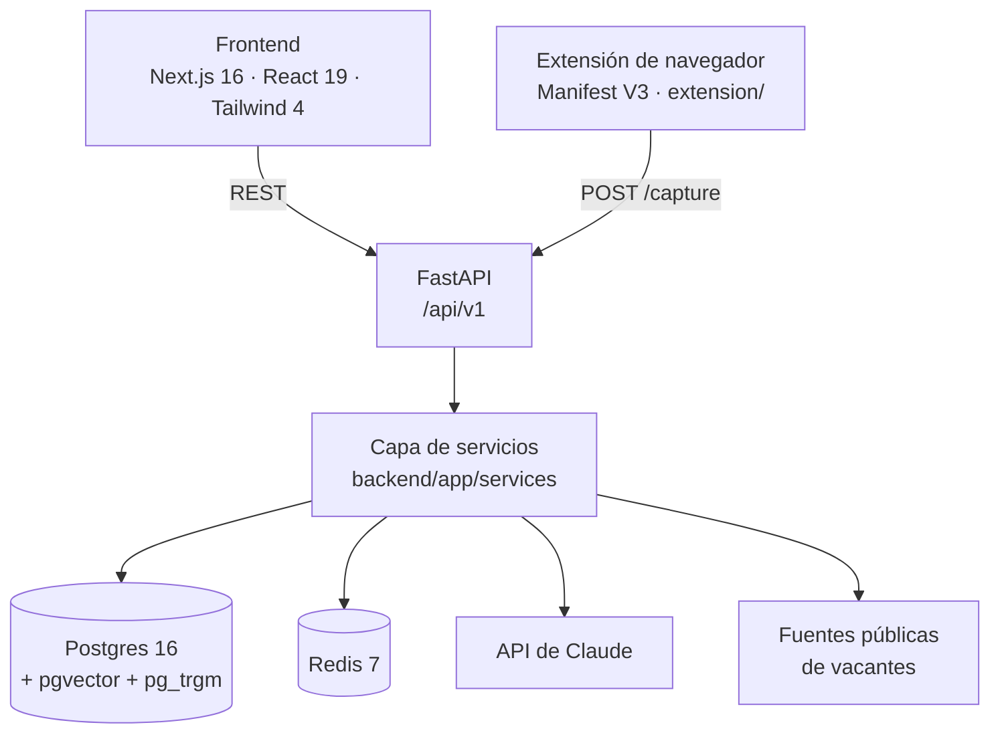
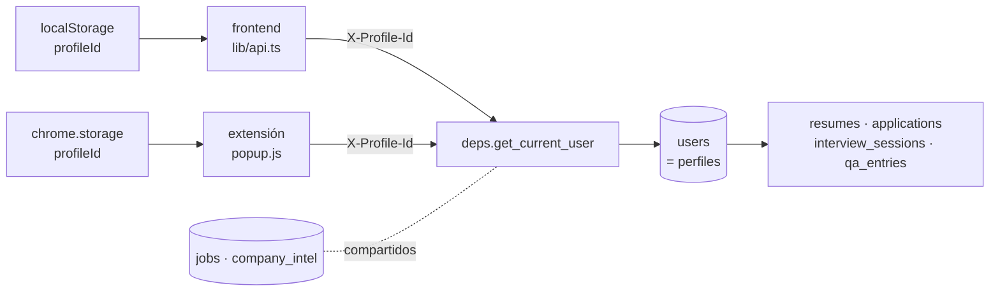
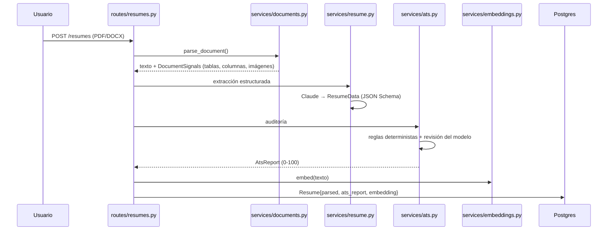

# Arquitectura

[← Índice](index.md)

## Vista general



## Capas

El backend es una cebolla de cuatro capas y la regla es que nunca se salta hacia
atrás: una ruta no habla con la base de datos sin pasar por un servicio, y un
servicio no conoce FastAPI.

| Capa | Carpeta | Responsabilidad |
|---|---|---|
| Rutas | `app/api/routes/` | HTTP: validar entrada, elegir códigos de estado, serializar |
| Servicios | `app/services/` | Toda la lógica de negocio. No importa nada de `fastapi` |
| Modelos | `app/models/` | Tablas SQLAlchemy. Ver [Modelo de datos](modelo-de-datos.md) |
| Esquemas | `app/schemas/` | Pydantic: contrato de la API y contrato de salida del LLM |

`app/api/deps.py` concentra las dependencias compartidas (sesión de BD, perfil
actual, resolución de `job_id`/`resume_id`/`application_id` con 404 automático).

## Perfiles

Varias personas comparten instalación. El perfil activo viaja en la cabecera
`X-Profile-Id` y `get_current_user` lo resuelve; sin cabecera, el perfil por
defecto. Como todas las rutas ya filtraban por `user.id`, ninguna tuvo que
cambiar. Ver [ADR 0008](adr/0008-multiperfil.md).



## La decisión que explica casi todo

Cada capacidad se resuelve con la mezcla más barata que dé el resultado correcto:
lo determinista en Python, lo que exige criterio en Claude.

| Capacidad | Parte determinista | Parte del modelo |
|---|---|---|
| Auditoría ATS | Formato, densidad de keywords, secciones ausentes | Si un bullet realmente vende |
| Matching | Cobertura de skills (taxonomía), distancia de seniority | Análisis cualitativo bajo demanda |
| Vacantes | Deduplicación, parseo de fechas | Normalización del texto libre a JSON |
| Intel | Cacheo y expiración | Búsqueda web con `sources` y `confidence` |

Consecuencia práctica: **sin `ANTHROPIC_API_KEY` el sistema arranca igual**, en
modo degradado (parsing heurístico, matching por taxonomía, sin tailoring ni
intel ni simulacros). `main.py` lo avisa con un warning en el arranque.

## Flujo 1 — Del CV al informe ATS



`DocumentSignals` existe porque hay penalizaciones de ATS que solo se ven mirando
el archivo, no el texto ya extraído: tablas, multi-columna, imágenes, fuentes raras.

El informe se puede descargar en PDF (`GET /resumes/{id}/report.pdf`). Lo maqueta
`services/report_pdf.py` con reportlab usando la paleta de `globals.css`; las
fuentes estándar de PDF solo cubren Windows-1252, así que los caracteres fuera de
ese juego (flechas, emojis del LLM) se sustituyen antes de dibujar.

## Flujo 2 - Del CV a las vacantes y al match

```mermaid
sequenceDiagram
    participant J as routes/jobs.py
    participant P as services/job_search.py
    participant SR as services/sources/
    participant G as services/geo.py
    participant N as services/jobs.py
    participant M as services/matching.py
    participant DB as Postgres

    J->>P: GET /jobs/search-plan?resume_id
    P->>P: Claude (effort low) → 2-4 puestos en inglés + país
    J->>SR: POST /jobs/ingest (puestos × fuentes, en paralelo)
    SR-->>J: RawJob[] (Himalayas/Jobicy ya filtran por país)
    J->>G: location_matches() para las que no filtran
    J->>N: normalizar (heurística; Claude si analyze=true)
    N->>DB: upsert por (source, external_id)
    J->>M: GET /jobs/{id}/match
    M->>M: 0.50 skills + 0.35 semántico + 0.15 seniority
    M->>DB: JobMatch cacheado
```

**Por qué un plan de búsqueda.** Las bolsas globales están en inglés y buscan por
título de puesto: "Diseñadora Gráfica" o "Computer Engineering Student &
Automation Technologist" no devuelven nada útil. Claude traduce el CV a títulos
realistas; sin API key se usan los del CV tal cual. El usuario los ve y los
edita, y la última versión usada se guarda por CV.

**Por qué filtrar por país.** Casi todo lo "remoto" tiene restricción geográfica
("USA only", "LATAM", 70 países). `services/geo.py` reduce eso a una pregunta:
¿se puede postular desde el país del perfil? Ante la duda (sin ubicación,
"Remote" a secas) la vacante se conserva. El mismo criterio filtra el listado
(`country` en `/jobs/search`) mediante `geo.sql_patterns()`.

**Fuentes.** Himalayas y Jobicy (globales, con filtro de país en la API),
Remotive y RemoteOK (remotas, se filtran al ingerir) y Arbeitnow (casi todo
Alemania, desactivada por defecto). El feed público de Remotive ya ignora el
parámetro de búsqueda, así que se filtra localmente por título y etiquetas.

El score no es coseno puro. Un reclutador filtra por skills duras antes que por
parecido general, así que la cobertura de requisitos pesa más y la similitud
semántica actúa de desempate. Pesos en `services/matching.py:WEIGHTS`.

## Por qué hay una extensión y no un scraper

LinkedIn, Indeed, Glassdoor, Workday, Greenhouse, Lever y Taleo prohíben el
scraping en sus términos y banean cuentas. La extensión lee la página que el
usuario **ya tiene abierta en su propia sesión** y la envía a `/api/v1/capture`.
Las fuentes de `services/sources/` son solo las que ofrecen API pública sin key.

La extensión vive en `extension/` (Manifest V3): un `popup` para capturar y ver
el match, `extractors.js` con un extractor por portal, y `autofill.js` para
rellenar formularios. Sus `host_permissions` apuntan solo a `localhost:8000`.
Con más de un perfil, el popup muestra un selector: la captura, el match y el
autofill usan el perfil elegido.

Detalle en [ADR 0004](adr/0004-extension-en-vez-de-scraping.md).

## Frontend

Next.js con App Router. `src/lib/api.ts` es el único punto que habla con el
backend y `src/lib/types.ts` refleja los esquemas Pydantic, así que un cambio de
contrato se ve en un solo sitio.

| Ruta | Pantalla |
|---|---|
| `/` | Panel |
| `/cv` | Mis CV: subida, informe ATS, PDF para descargar o compartir, diff de tailoring |
| `/vacantes` · `/vacantes/[id]` | Búsqueda según un CV, filtro por país, match · dossier e intel |
| `/pipeline` | Kanban de postulaciones |
| `/entrevistas` | Simulacro y banco de respuestas |
| `/perfiles` | Crear, renombrar, cambiar y borrar perfiles |
| `/ajustes` | Preferencias de búsqueda |

El selector de perfil vive en la barra lateral (`components/nav.tsx`). Todas las
pantallas piden sus datos con el perfil activo porque `lib/api.ts` añade la
cabecera en cada petición; los GET que la red corta se reintentan una vez.

## Notas relacionadas

- [Modelo de datos](modelo-de-datos.md)
- [API](api.md)
- [Decisiones](adr/index.md)
