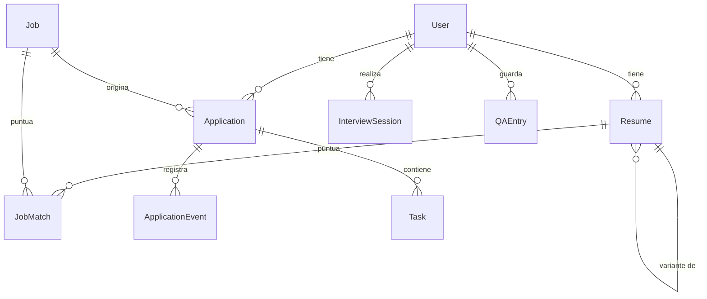

# Modelo de datos

[← Índice](index.md) · Fuente: `backend/app/models/entities.py`

Todo vive en Postgres. Tres tipos de columna con propósitos distintos:

- **Escalares** — lo que se filtra y se ordena en SQL.
- **`JSONB`** — las estructuras que produce el LLM. Evolucionan rápido y no quiero
  una migración cada vez que un esquema Pydantic gana un campo. Cada columna
  `JSONB` tiene un modelo Pydantic espejo en `app/schemas/`.
- **`Vector(EMBEDDING_DIM)`** — búsqueda semántica vía pgvector.

## Tablas

| Tabla | Para qué | Campos que conviene conocer |
|---|---|---|
| `users` | Un perfil por persona ([ADR 0008](adr/0008-multiperfil.md)) | `preferences` (JSONB): datos de autofill y `job_search:<resume_id>` con la última búsqueda por CV |
| `resumes` | CV y sus variantes | `parsed`, `ats_report`, `ats_score`, `embedding`, `parent_id`, `tailored_for_job_id` |
| `jobs` | Vacantes normalizadas | `requirements` (JSONB), `embedding`, único por `(source, external_id)` |
| `job_matches` | Match cacheado CV×vacante | `score` y sus tres componentes, `matched_skills`, `missing_skills`, `analysis` |
| `applications` | CRM / Kanban | `status`, `board_order`, `cover_letter`, `next_action_at`; único por `(user_id, job_id)` |
| `application_events` | Timeline | `kind`, `payload` (JSONB) |
| `tasks` | Checklist por postulación | `category`, `done`, `due_at`, `order_index` |
| `company_intel` | Investigación cacheada | único por `company_key`, con `refreshed_at` para expirar |
| `interview_insights` | Cómo entrevista una empresa | único por `(company_key, role_key)` |
| `interview_sessions` | Simulacros | `transcript` (JSONB), `summary`, `finished` |
| `qa_entries` | Banco personal de respuestas | `embedding` para recuperar la respuesta parecida |

## Detalles que no se ven en el diagrama

**Perfiles.** Cada fila de `users` es una persona y se elige por la cabecera
`X-Profile-Id`. No hay tabla propia: todo lo personal ya colgaba de `user_id`.
Lo que **no** es por perfil: `jobs`, `company_intel` e `interview_insights` son
datos de mercado compartidos; `job_matches` va por CV, así que queda aislado de
hecho. Borrar un perfil arrastra sus CV, postulaciones, simulacros y respuestas
(`ondelete=CASCADE`). Los perfiles creados desde la app llevan un email
sintético porque la columna es única.

**Variantes de CV.** Un CV adaptado a una oferta es otra fila en `resumes`, con
`parent_id` apuntando al original y `tailored_for_job_id` a la vacante. Nunca se
sobrescribe el CV base. Ver [ADR 0005](adr/0005-tailoring-con-aprobacion.md).

**Estados del Kanban.** `ApplicationStatus` define el orden del tablero: `saved →
applied → recruiter_contact → technical_test → final_interview → offer`, más
`rejected` y `withdrawn` fuera del flujo. `ACTIVE_STATUSES` excluye esos dos.

**Dimensión del embedding.** `EMB_DIM` se lee de `settings.embedding_dim` **en
tiempo de import**. Cambiar `EMBEDDING_DIM` en el `.env` con datos ya guardados
rompe las columnas `Vector`: hay que recrear las tablas y reindexar
(`POST /api/v1/jobs/reindex`). Ver [ADR 0002](adr/0002-embeddings.md).

**Creación del esquema.** No hay Alembic. `app/db/init_db.py` crea extensiones
(`vector`, `pg_trgm`), tablas y el perfil por defecto en el arranque. Ver
[ADR 0003](adr/0003-sin-migraciones.md).
